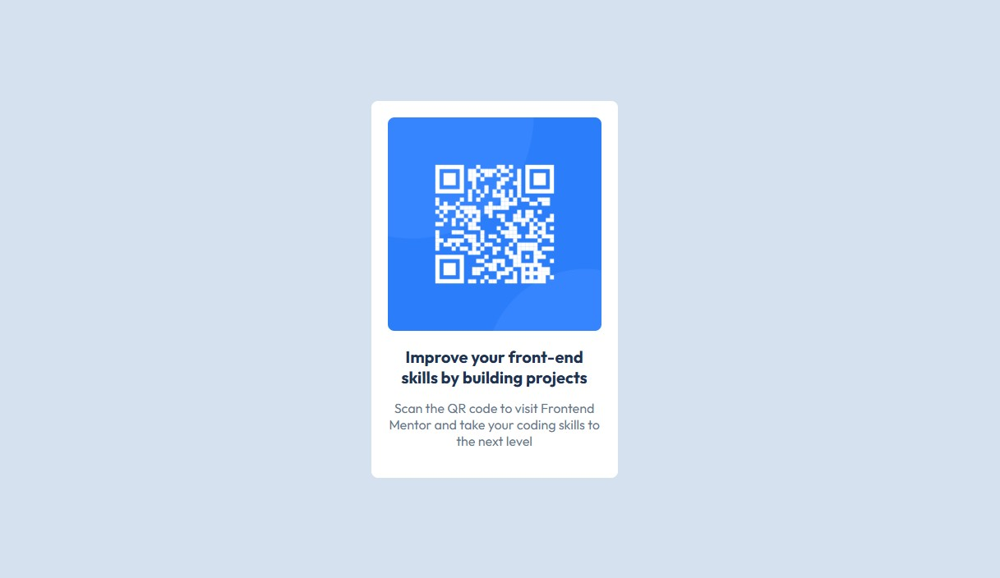

# Frontend Mentor - QR Code Component

## Screenshot

A simple solution to the Frontend Mentor **QR Code Component** challenge.

## Live Demo
- **Solution URL:** https://qr-code-component-vite.netlify.app/
- **Live Site:** https://www.frontendmentor.io/challenges/qr-code-component-iux_sIO_H

## Built With
- Vite
- HTML5
- SCSS
- Mobile-first workflow

## What I Learned
- Building small UI components with semantic HTML
- Centering and styling using Flexbox
- Creating simple responsive layouts

## Author
- Frontend Mentor: https://www.frontendmentor.io
- Developer: hiticasmihai7@gmail.com